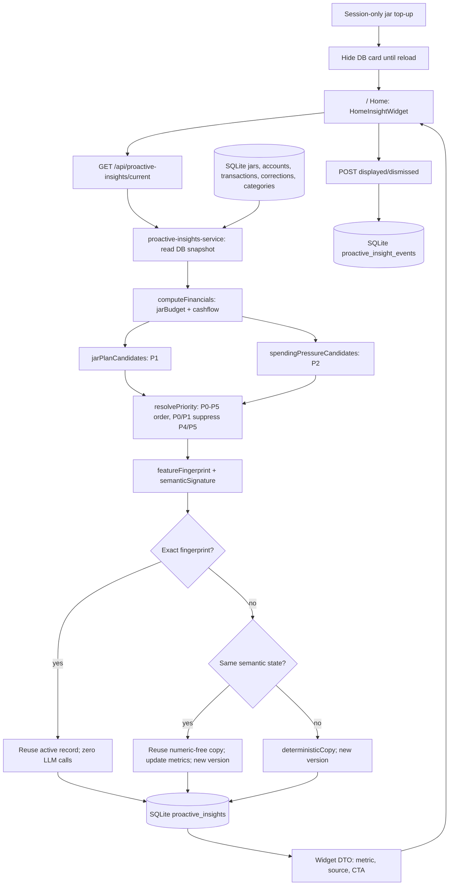

# Proactive Insight Trigger / Home Widget — implementation plan v1

## Scope and evidence

Inspected and implemented in `D:/MSB Hackathon/pfm` on 2026-09-23. This is a mock-data-first Next.js PFM prototype. The `/` Home in `src/app/(festive)/page.tsx` now mounts `HomeInsightWidget` below the account card. The jars the user sees remain on `/pfm?tab=overview`, composed by `src/components/pfm/OverviewTab.tsx` → `HuOverviewRow.tsx`. `docs/INSIGHT_FEATURE_ARCHIVE.md` contains retired widget code; the new widget uses the DB-backed proactive pipeline described below.

The five named Customer Snapshot/Memory documents from the referenced conversation were not present in this repo or adjacent MSB folders. That conversation's schema belongs to Sales Assistant/Customer Detail and is **not** used to mark a PFM Home field available. `wireframe_customer_detail.png` was not found and is not used. The architectural principles are consistent with this repo's `docs/ARCHITECTURE.md`: financial facts belong to the deterministic engine; persist derived insight separately; send only selected facts to an LLM. The product and architecture docs contain stale descriptions of unmounted insight UI, so current code takes precedence.

## Running Home insight flow



The server-side service reads the same underlying stores and correction policy as `useFinancials`, never rendered UI. Corrections and manual transactions are SQLite-backed through `/api/corrections` and `/api/manual-transactions`; their old localStorage paths are migration/failure fallbacks. Session jar top-ups and user-authored liabilities/goals remain client-side, so the widget hides after a session top-up and P0/P3 are disabled. `src/app/api/jar-summary/route.ts` also reuses `computeFinancials` but is not the Home insight source.

## Inventory and UI → source trace

| UI/use | Contract and source | Raw fields and caveat |
|---|---|---|
| `/` account card | `src/app/(festive)/page.tsx` → `useFinancials` → `Providers.listAccounts` (`src/providers/mock/mock-provider.ts`) → `/api/accounts` → `src/lib/accounts-store.ts` → `data/schema.sql` `accounts` | `Account.type`, `balance`, `availableBalance`, `lastSyncedAt`, `source` (`src/domain/models/index.ts`). Home card displays **balance** of first current account; jar CASA pool sums **availableBalance** of all current accounts. No account should be mistaken for credit-card cash. Provider currently returns `[]` on HTTP failure, which can look like missing data; fix before server launch. |
| `/pfm` jar cards | `OverviewTab.tsx` → `useFinancials.ts` + `state/jars.tsx` → `Providers.getJarConfig` → `/api/jars` → `jars-store.ts` → SQLite `jars` | Stored `id`, `label`, `category_ids`, nullable `budget_limit`, display `color/icon`. `Jar.budgetLimit` optional; no stored `jar_remaining`, `bucket_budget` or bucket account. `HuOverviewRow.tsx` renders `Financials.jarEnvelope.jars[].remaining`. |
| Jar spend/balance | `finance-compose.ts` → `jar-budget.ts` + `jar-envelope.ts` | `Transaction` JSON payload in SQLite `transactions`; `jarBudget.lines[].spent` is posted net expense over jar categories, including refund behavior, correction/hidden policy from `useFinancials.ts`; `remaining = budgetLimit - spent + rebalanceNet`. `/api/jar-summary` already exposes `budgetLimit`, `spent`, `remaining`, `spendable`, `overLimit` using shared engine. |
| Credit card | `Account.type=credit_card` and `Liability.type=credit_card` (`models/index.ts`); mock `personas.ts` | Account has `balance/availableBalance`, **not** statement due amount/date. Liability has `minimumPayment`, `dueDate`, `outstandingPrincipal`, `lastUpdatedAt`; seeded examples include card liabilities. Treat `minimumPayment` as minimum payment only, never full statement due. User liabilities use provider local record store. |
| Income/spending/history | `/api/transactions` → `transactions-store.ts` → SQLite JSON `Transaction`; `cashflow.ts`/`finance-compose.ts` | `type=income` transactions yield money-in, no declared-income field in this app. Posted expense/refund/category/MoM aggregates are derived; internal transfers/card payments excluded. `src/providers/mock/fixtures/generate.ts` seeds demo history. |
| Goals/savings | `Providers.listGoals` seed fixtures, `getUserGoals` local store; `state/goals.tsx`; `Goal` model. Savings account comes from `Account.type=savings`; assets also include `type=deposit`. | Goal `targetAmount`, `currentAmount`, nullable `targetDate`; user `monthlyContribution` is optional. No dated contribution series or goal `lastUpdatedAt`, so schedule deviation is not established. |
| Obligations | `finance-compose.ts` → `obligations.ts`; liability fixtures and recurring detection | `Obligation.amount` can be `unknown`; recurring due date is predicted from prior transaction day. `upcoming-obligation.ts` currently chooses largest known amount and reports days from fixed `DEMO_NOW`; it does not establish liquidity shortfall. |
| Existing PFM insights vs Home widget | `src/insights/run.ts`, `detectors/*`, `state/useInsights.ts`; new `src/insights/proactive/*`, `src/lib/proactive-insights-service.ts` | The old PFM insight list still sorts by severity and uses browser `localStorage`. The Home widget uses its separate DB-backed proactive Store, exact/semantic cache, and Home API. |

**Verified cross-repo contract discrepancy:** `src/app/api/jar-summary/route.ts:77` returns `allocationHeadroom = fin.jarEnvelope.pending.amount`, currently `CASA − Σ spendable`. `D:/MSB Hackathon/personal-pfm-agent/backend_docs/pfm-read-api.md:108` still describes `allocationHeadroom` as `CASA − Σ budgetLimit` and calls it the write cap. The current PFM engine and allocation sheet use the spendable lens. Reconcile the agent-facing document, API field name/meaning, and write guard before using this field as an insight input; do not infer headroom from the older document.

## Data gap classification

- **AVAILABLE**: jar config/limit/category mapping, account balances and sync timestamp, posted transaction fields, liability minimum payment/due date in mock/user records, goals and savings account fields.
- **DERIVABLE with current engine**: jar spent/remaining/usage/status, CASA pool, current/previous category spend, recurring obligations, goal gap. Use existing engine outputs. An unset jar limit stays null; no current account means unknown CASA.
- **PARTIAL**: a full payment/liquidity shortfall cannot be inferred from the current minimum-payment reminder. Jar depletion forecast needs an observation policy. Goal schedule deviation needs dated contribution history. Session top-ups and user liabilities/goals are not available to the current server computation.
- **MISSING/BLOCKED**: card statement amount/date, complete outstanding upcoming obligations, approved safety buffer and investable surplus policy, production eligibility/product recommendation. The demo SQLite Store and versioned Home API are now implemented; production identity/freshness policy remains open.

The machine-readable JSON feature and rule registries beside this document define inputs, formulas, null behavior, thresholds, signatures, actions, and readiness. `READY` for the DB-backed Home MVP requires persisted input availability; current READY rules are `jar_plan_pressure` and `spending_spike`. `known_payment_due_reminder` is PARTIAL for this MVP because liabilities are not in SQLite, despite its pure fixture-backed candidate function. The proposed P0 `payment_liquidity_shortfall` remains PARTIAL because obligation completeness and safety reserve are unproven. Existing `jar_overspend_covered`/`jar_needs_manual_cover` are available deterministic narratives but need deduplication and a clear Home policy before promotion as separate registry rules.

## Priority resolver

1. Reject a candidate if any required feature is unknown, stale, invalid, or from a failed load. Apply a validated max-age policy by source before production. Retain provenance on every metric.
2. Generate rule candidates with pure engine functions. The LLM never decides triggers, severity, eligibility, amounts, or priority. `P0 > P1 > P2 > P3 > P4 > P5`. Within a class, sort by severity (`urgent > attention > info`), then nearest due date for P0 or largest risk magnitude for P1/P2, then stable entity ID. Current `runDetectors` only sorts severity; it cannot implement this policy by itself.
3. Deduplicate the same jar event: a funded overspend belongs to the covered narrative; an unfunded overspend belongs to pressure/manual-cover. A positive message requires no active P0–P4 candidate. Any active P0/P1 suppresses P4/P5. Display one Home card and retain other eligible candidates for audit/feed.
4. Apply persisted user dismissal/snooze per `customer + insight_type + entity + semantic_state` with expiry. A material worsening (new severity/signature) may reappear; identical state during cooldown does not. Default proposed cooldowns are in the rule registry and require product sign-off.

## Store and cache lifecycle

Proposed SQLite prototype tables (pilot should use the same logical contract in the durable service DB):

```sql
CREATE TABLE insight_versions (
  id TEXT PRIMARY KEY,
  cif TEXT NOT NULL,
  insight_type TEXT NOT NULL,
  entity_id TEXT NOT NULL,
  period_key TEXT NOT NULL,
  rule_version TEXT NOT NULL,
  feature_version TEXT NOT NULL,
  prompt_version TEXT NOT NULL,
  data_fingerprint TEXT NOT NULL,
  semantic_signature TEXT NOT NULL,
  source_snapshot_id TEXT NOT NULL,
  source_snapshot_at TEXT,
  facts_json TEXT NOT NULL,
  copy_template_json TEXT NOT NULL,
  widget_json TEXT NOT NULL,
  status TEXT NOT NULL CHECK (status IN ('active','resolved','superseded','expired')),
  version INTEGER NOT NULL,
  supersedes_id TEXT,
  created_at TEXT NOT NULL,
  expires_at TEXT,
  UNIQUE (cif, insight_type, entity_id, period_key, version)
);
CREATE INDEX idx_insight_active ON insight_versions(cif, status, period_key);
CREATE UNIQUE INDEX idx_one_active_insight ON insight_versions(cif, insight_type, entity_id, period_key) WHERE status = 'active';
CREATE TABLE insight_interactions (
  cif TEXT NOT NULL, insight_id TEXT NOT NULL,
  action TEXT NOT NULL CHECK (action IN ('seen','dismissed','snoozed','acknowledged','helpful')),
  action_at TEXT NOT NULL, until_at TEXT,
  PRIMARY KEY (cif, insight_id, action, action_at)
);
```

Compute an exact SHA-256 fingerprint from **canonical JSON of only relevant deterministic feature values** plus source IDs/revisions/freshness, period, customer scope, `rule_version`, `feature_version`, and threshold policy. Sort keys and sets; preserve null distinct from zero. Exclude presentation-only labels unless they appear in copy. Do not hash full customer rows or send them to the LLM. The semantic signature hashes rule/entity/period, trigger state, severity, threshold band, action, and policy version; do not include every small metric change. Store exact values in `facts_json` for audit.

Transaction/label writes, jar config writes, and account balance changes must invalidate the relevant cache; absent a reliable `updated_at` on jars and accounts, the service must read current values and hash them, rather than trust a timestamp alone. Per-customer, per-entity locking/unique version assignment prevents duplicate LLM calls. State machine:

```text
read sources → compute features → eligible candidates → priority
  → exact fingerprint active hit: return stored DTO, 0 LLM calls
  → fingerprint changed, semantic signature same: reuse validated numeric-free copy,
    attach newly computed structured metrics; persist new facts/DTO version, 0 LLM calls
  → semantic state/material change: deterministic fallback immediately; optionally
    call LLM once, validate, supersede old active version atomically and persist new
  → missing/stale data: suppress candidate; expire prior active display safely
```

An active trigger that no longer fires transitions to `resolved`; a material state change creates a new `active` version and marks the prior one `superseded`; cycle end or stale-data TTL marks it `expired`. Interaction events never resolve a financial condition on their own.

Never reuse a sentence containing stale numeric literals. The v1 LLM contract uses numeric-free title/body; the widget renders amounts/dates from separately validated structured metrics. A changed label may also need a new semantic signature or fixed copy. `Insight Store` is derived analytics/cache; `Customer DB` and provider sources remain financial truth. Mem0, if introduced elsewhere, is not a snapshot or insight cache.

## Home API and widget contract

Proposed `GET /api/proactive-insights/current` (authenticated customer scope; no caller-supplied arbitrary `cif` in production). Return `200` with `{status:"ready", card, asOf, ruleVersion}`; `card:null` with `reason:"no_eligible_insight" | "insufficient_data"`; `503` for source outage. Response card:

```json
{
  "id": "opaque-version-id", "insightType": "jar_plan_pressure", "priorityClass": "P1",
  "severity": "attention", "title": "Hũ Ăn uống gần hạn mức",
  "body": "Bạn có thể xem lại chi tiêu trong hũ này.",
  "metrics": [{"key":"spent","value":800000,"unit":"VND","source":"mock","period":"2026-09"},{"key":"budget_limit","value":1000000,"unit":"VND","source":"pfm_config","period":"2026-09"}],
  "asOf": "2026-09-15T00:00:00.000Z", "freshness": "2026-09-14T10:00:00.000Z",
  "action": {"type":"navigate","href":"/pfm?tab=budget","label":"Xem hũ"},
  "dismissible": true
}
```

This JSON is an illustrative **derived DTO**, not an existing backend response. The route must not accept financial facts from the browser as truth. UI shows loading/error/insufficient states, source/freshness, and one card without blocking existing account/quick actions. A click navigates; no automatic transfer or product purchase. Use consent and authenticated identity before pilot.

## Phases and migration

1. **Source convergence:** fix `listAccounts` HTTP failure handling; make server computation match correction, manual transaction, jar, account, liability, and goal visibility; add trustworthy revisions/freshness; reconcile `jar-summary` with client `useFinancials`. Confirm product placement on `/` (the current Home), and update stale docs.
2. **Deterministic rules:** extract feature snapshot selectors from `Financials`, add P0 eligibility with honest minimum-payment wording, P1/P2 boundary rules and resolver. `knownPaymentCandidates` already compares raw `Liability.dueDate` (`YYYY-MM-DD`) by VN calendar day; preserve that behavior when moving to server snapshots. Add source freshness/null/outlier gates. Keep the existing jar semantics.
3. **Store/cache:** additive SQLite migration for `insight_versions`/`insight_interactions`; no financial backfill is required. First authenticated read computes an initial version. Historical browser `localStorage` dismissals cannot be trusted as cross-device state; optionally migrate only with explicit same-customer binding, otherwise start fresh. Do not run `db:seed` as a migration, because it resets demo data.
4. **Copywriter and API:** implement JSON-only copy endpoint behind the server AI facade, validate against structured facts and render deterministic fallback on failure. Wire the Home widget to the read API. Never pass a full customer row or account number to the model.
5. **Pilot gates:** sign off source max age, obligation completeness, thresholds/cooldowns, semantic bands, privacy and evaluation set. Add card statement/goal history/buffer adapters before activating blocked rules.

## Delivered SQLite demo MVP (2026-09-23)

The implementation now runs on `/` through `src/components/home/HomeInsightWidget.tsx`. `GET /api/proactive-insights/current?cif=<demo persona>` reads SQLite `jars`, `accounts`, `transactions`, `transaction_corrections`, and `categories` through their existing stores, applies corrections, and calls the shared `computeFinancials`. It runs P1 `jar_plan_pressure` and P2 `spending_spike`, resolves one top candidate, and materializes it in SQLite `proactive_insights`. `POST` records display/dismiss events in `proactive_insight_events`. The actual API response is `{insight, cache, month, source:"sqlite"}` and the card shape is `src/insights/proactive/widget.ts`; the proposed DTO and schema above remain the fuller pilot design, not the shipped MVP contract.

The MVP uses deterministic, numeric-free Vietnamese copy in `widget.ts`, so it makes **zero LLM calls** even for a new semantic state. Exact fingerprint hits perform no write. A metric-only change persists a new version with reused copy; a material state change persists new copy and supersedes the active version. Dismissal suppresses the unchanged fingerprint and a changed fact can create a new version. When no candidate remains, the active record resolves. The schema is additive and runs automatically via `getDb()`; do not run `db:seed` for migration.

The Home widget hides while session-only jar top-ups exist because those changes are absent from SQLite and would make its DB-backed balance disagree with the client view. The MVP does not include P0 payments, since liabilities exist in persona fixtures/browser state rather than SQLite. It also does not include P4/P5 or investment suggestions. The `cif` query is limited to the four demo personas, but is not authenticated; a real session-bound customer identity is required before production. Source-age policies, explicit cycle expiry, LLM adapter, and full interaction fatigue remain pilot work.

Run and verification steps are in `docs/insights/proactive_insight_mvp_demo.md`.
